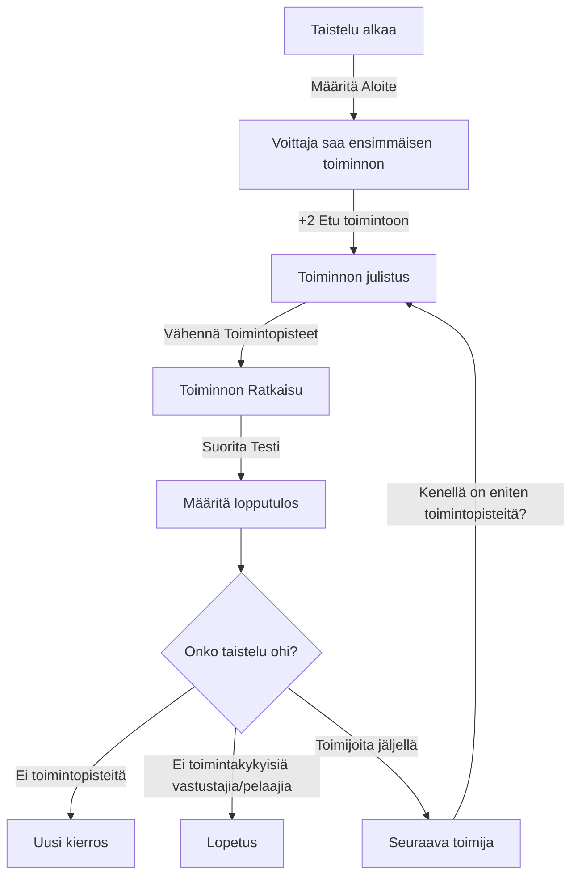

# Taistelukierrokset

Taistelu jaetaan kierroksiin. Yksi kierros vastaa noin 6 sekuntia pelin maailmassa. Yhden kierroksen aikana kukin osallistuja saa toimia niin monta kertaa kuin ehtii **Toimintopisteidensä** puitteissa. Lähtökohtaisesti taistelut alkavat siitä, että joku **tekee aloitteen**, eli julistaa ensimmäisen toiminnon. Aloitteen tekijällä on aina etulyöntiasema, mutta muut toimijat voivat yrittää väliin, mikäli ovat tietoisia siitä, että nyt alkaa tapahtua. Siksi taistelun alkaessa määritetään aina **Aloite**, mikä määrää sen kuka saa tehdä taistelun *ensimmäisen* toiminnon.

Aloitetta varten testataan **Taisteluvalmius**-taitoa. Paras lukema voittaa. Aloitteentekijä saa aina +2 edun toimintoonsa. Jos hahmo joutuu yllätetyksi, ei hän saa heittää aloitetta lainkaan, vaan häviää sen automaattisesti.

Ensimmäisen **toiminnon** jälkeen edetään siinä järjestyksessä kenellä on eniten **toimintopisteitä**. Jos hahmoilla on saman verran toimintopisteitä, voit verrata hahmojen Spiidi-kykyä, ja toimia suurimman Spiidin mukaisessa järjestyksessä. Jos yhdellä hahmolla on niin paljon toimintopisteitä, että hän on jatkuvasti muita taistelijoita edellä, saa hän tosiaan toimia aina kun hänellä on eniten toimintopisteitä. Tämä voi kuulostaa epäreilulta, mutta niin se vaan menee.

Jokaisen toiminnon jälkeen hahmo vähentää toimintopisteistään toiminnon pistemäärän verran. Niin sanottu "standardi" toiminto on 2 pistettä. Tämä antaisi keskivertohahmolle 2 toimintoa joka kierroksessa.

Toimintopisteitä voi **säästää**: Jokainen 2 säästettyä toimintopistettä säästää ensikierrokselle yhden toimintopisteen.

Uuden kierroksen alettua hahmon toimintopisteet nollautuvat lukemaan: Toimintopisteet + Säästetyt toimintopisteet / 2.

Joitain toiminta voi myös tehdä **Reaktioina**, jolloin toiminnon voi julistaa kesken toisen hahmon vuoroa, esimerkiksi puolustautuakseen. Hahmolla pitää tällöin olla riittävä määrä toimintopisteitä käytettävissä. Tekemällä reaktion hän myös viivyttää seuraavaa toimintoaan, koska hänellä on seuraavaksi vähemmän toimintopisteitä käytössään.

| Toiminto               | TP  | Kuvaus                                                         | Reaktio | Testi                             |
| ---------------------- | --- | -------------------------------------------------------------- | ------- | --------------------------------- |
| Liikkuminen            | 1-5 | Hahmo voi liikkue liikenopeutensa verran.                      | Ei      | `Urheilu`, tarvittaessa           |
| Aseeton hyökkäys       | 2   | Hahmo voi hyökätä ilman aseita                                 | Ei      | `Taistelulajit` tai `Nyrkkitappo` |
| Melee hyökkäys         | 2-4 | Hahmo voi hyökätä lähitaisteluaseella                          | Ei      | `Taistelulajit`                   |
| Vastahyökkäys          | 2-4 | Puolustus ja hyökkäys lähitaistelussa                          | Kyllä   | `Taistelulajit`                   |
| Ampuminen              | 2-4 | Hgahmo voi ampua kohdetta                                       | Ei      | `Ampumataito`                     |
| Jatkuva sarjatuli      | 1   | Täyden sarjatulen jatkaminen                                   | Ei      | `Ampumataito`                     |
| Väistäminen            | 2   | Hahmo pyrkii väistämään hyökkäyksen                            | Kyllä   | `Väistäminen`                     |
| Suojautuminen          | 1   | Hahmo hyödyntää läheistä suojaa                                | Kyllä   | Ei testiä.                        |
| Kranaatin virittäminen | 1   | Hahmo virittää kranaatin toimintavalmiiksi                     | Ei      | Ei testiä                         |
| Heittäminen            | 2-4 | Hahmo käyttää heittoasetta, esim. kranaattia tai heittoveistäå | Ei      | `Urheilu + Notku`                 |
|                        |     |                                                                |         |                                   |

> **Pahan Pekan tarina...**
>
> Motoristilla oli kierroksen alussa 4 toimintopistettä, joista hän käytti jo 2 pistettä Pahan Pekan iskun väistämiseen, ja saikin ilmaisen iskun. Paha Pekka puolestaan menetti loput kierroksestaan, jouduttuaan pökerryksiin. Motoristi voi siis toimia uudestaan, ja päättää pamauttaa nyrkkiraudalla pökerryksissä olevaa Pekkaa naamaan. Motoristi heittä kolmella nopalla 9,8,4 josta paras on 9, ja tähän tulee -3 motoristin kyvyistä ja humalatilasta.  Lopputulos 6 on enemmän kuin Pekan peruspuolustus 5, joten Motoristi Osuu. Taas. Hän heittää vahingon D6:lla (se laskettiin, jo, joten ei tarvitse laskea uudestaan) ja saa tulokseksi 2 pistettä vahinkoa. Tästä ei tule vammaa, mutta Pekan HP tippuu nolliin, ja hän menettää tajuntansa.