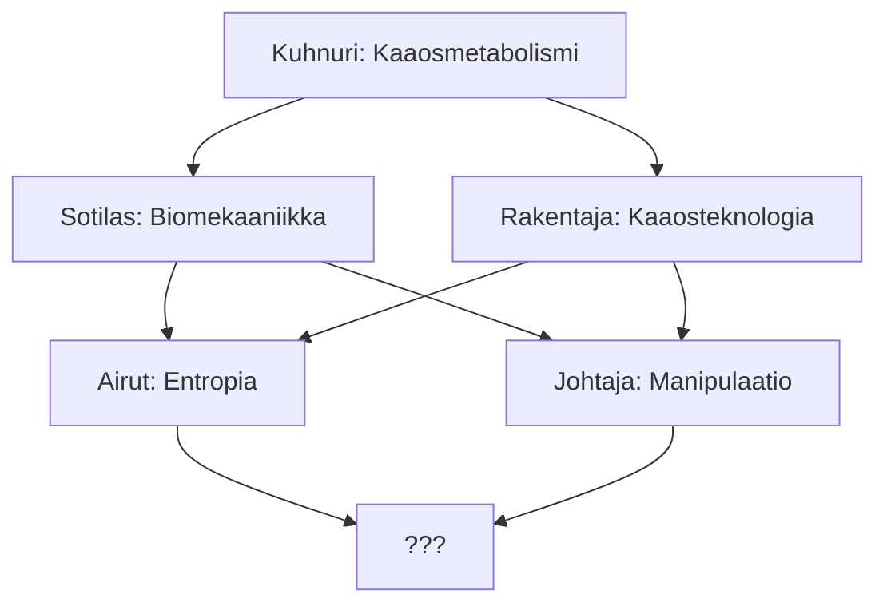

# 06 Kaaosvoimat

## Kaaosvoimien lähde
Kaaosmaagit ovat symbiontteja. Isäntä, eli alkuperäinen ihminen, kääpiö, haltia, tai mutantti, elää yhdessä loiseliön kanssa, jolla on oma tietoisuus. Kaaosloisella on poikkeuksellinen kyky kanavoida Kaaosta, ja vaikuttaa todellisuuteen selittämättömällä tavalla, eli maagisesti. 

Loisen alkuperä ja historia on tuntematon, mutta niiden epäillään olevan maan  ulkopuolista alkuperää. Loiset eivät yleensä ole kovin puheliaita itsestään, eikä isännällä juuri ole keinoja kiristää siltä mitään tietoa.

Kaaosmagian käyttäminen ei oikeastaan vaadi mitään taitoa, sillä kyse on lähinnä neuvottelusta loisen kanssa. Asiat joko onnistuvat, tai ei onnistuvat. Joskus ne myös onnistuvat vähän eri tavalla kuin oli tarkoitus. Vaikka isäntä ja loinen kommunikoivat keskenään telepaattisesti, eivät viestit aina välity halutulla tavalla - tai jos vaikka välittyvät, niin loinen tekee aina oman tulkintansa.

### Kaaosvoimien saaminen
Kuka tahansa voi saada itselleen ikioman kaaosloisen osallistumalla Hyper Corpin Hyper-U -ohjelmaan. Kuka tahansa voi hakea, mutta osallistujat seulotaan yhteensopivuuden maksimoimiseksi ja tämän lisäksi osallistuminen maksaa 20 000 CR. Osallistujat viettevät 60 päivää Hyper Corpin retriitissä, jossa heille istutetaan kaaosloinen ja opetetaan käyttämään sitä.

Retriittiin aikana tulevat isännät vakuutetaan siitä, että heillä on koko ajan kontrolli loisesta. Totuus on kuitenkin hieman erilainen, nimittäin loinen on se joka voi käyttää kaaosvoimia, ja sen isäntä lähinnä voi neuvotella loisen kanssa siitä miten voimia käytetään. Loinen on kuitenkin lopulta se, joka voimia käyttää.

### Symbioosi
Symbioosilla mitataan sitä kuinka hyvin kaaosmaagi pystyy hyödyntämään loisensa kaaosvoimia. Parempi symbioosi tarkoittaa, että kaaosloinen suostuu helpommin siihen mitä kaaosmaagi haluaa yrittää, mutta myös syventää loisen ja isännän välistä yhteyttä. Korkealla symbioosilla asioiden salaaminen loiselta on vaikeaa, tai mahdotonta ja loisen ja isännän tavoitteiden täytyy olla samassa linjassa. Tavallaan symbioosilla mitataan loisen ja isännän välistä luottamusta.

Kun käytät kaaosvoimia, niin testaa **Symbioosi + Karuus**. Vaikeusaste riippuu loisen halusta käyttää voimiaan, ja tähän vaikuttaa loisen persoonallisuus ja agenda. Heitä nopalla loisen persoonallisuus ja agenda, mikäli tarpeellista. Loinen saa käskyjä korkeammilta tahoilta, joten agenda voi vaihdella tilanteen mukaan.

| D6  | Persoonallisuus | Agenda       |
|:--- |:--------------- | ------------ |
| 1   | Murhanhimoinen  | Murha        |
| 2   | Jekkuilija      | Sabotaasi    |
| 3   | Himokas         | Ryöstö       |
| 4   | Juonittelija    | Kiristäminen |
| 5   | Sadisti         | Kidnappaus   |
| 6   | Kurjuuttaja     | Kaaos        | 

## Kaaosvoimien käyttäminen
Kaaosvoimia mitataan pelissä **Kaaospisteillä**. Aloittavalla kaaosmaagilla on 3 kaaospistettä. Kaaospisteitä palautettua nopeasti käyttämällä **Hyper-U** ruisketta, tai **CHAG-X** huumetta, mutta sitä voi myös väliaikaisesti ympäröivästä kaaoksesta, *aiheuttamalla* kaaosta. Tällä tavoin kaaosmaagi voi väliaikaisesti ylittää maksiminsa.

## Kaaoskyvyt
Kaaosloisten hierarkia määrittelee kaaosloisen kyvyt. Korkeamman kastin kaaosloiset hallitsevat voimakkaampia kykyjä, mutta tapaavat myös olla vaikeampia yksilöitä.
**Kuhnuri [0p]:** Alimman kastin loinen, työläinen, palvelija. Kaaoskyky on **Kaaosmetabolismi**: kestävyys, regeneraatio ja isännän fyysiseen suorituskyvyn parantaminen
**Sotilas [1p]:** Keskitason loinen. Sotilaan kyky on **Biomekaniikka**: Sotilas muokkaa kehoaan rakentaakseen biomekaniisia aseita ja puolustuksia, ja jopa jonkinasteisia projektiiliaseita.
**Rakentaja [1p]:** Keskitason loinen. Rakentajan kyky on **Kaaosteknologia**, jolla se voi luoda teknologiaa, joka saa voimansa kaaoksesta. Kaaosteknologialla voi tehdä lähes mitä tahansa, mutta siinä tulee aina mukana haittavaikutuksia, joita on vaikea ennustaa ja käyttäminen vaatii kaaospisteitä.
**Airut [2p]:** Ylhäisen kastin loinen. Airut on kaaoksen lähettiläs, joka keskittyy asioiden rappeuttamiseen ja tuhoamiseen. Sen kaaoskyky on **Entropia**.
**Johtaja [2p]:** Ylhäisen kastin loinen. Johtajan kyky on **Manipulaatio**, jolla hän voi hallita heikkoja mieliä ja orjuuttaa ne omaan tahtoonsa.

Kaaosmaagin pitää valita **erikoispisteillä** Kaaosloisen kasti. Korkeamman kastin loinen maksaa enemmän pisteitä, mutta se saa oman kastinsa kaaoskyvyn lisäksi alemman kastin kyvyn. Jokaisella kaaosloisella on **Kaaosmetabolismi**, mutta Johtaja ja Airut voivat valita lisäksi, joko **Biomekaniiset aseet**, tai **Kaaosteknologian** kyvyikseen.

### Kaaosmetabolismi
Kaaosmetabolismin välittömiä vaikutuksia ovat hidastunut ikääntyminen ja luontainen resistanssi erilaisia taudinaiheuttajia ja sairauksia kohtaan.
#### Kestävyys
*1 kaaospiste*
Isäntä pysyy hereillä ja aktiivisena 48 tuntia tarvitsematta unta. Hän ei väsy, eikä tarvitse lepoa. Heitä kuitenkin satunnainen [ Sivuvaikutus](.md#Sivuvaikutukset%20) taulukosta. Sivuvaikutus lakkaa, kun voiman vaikutus lakkaa.
#### Regeneraatio
*1 kaaospiste*
Käyttäjä saa välittömästi takaisin 1d6 haavapistettä per käytetty kaaospiste. Heitä satunnainen [ Sivuvaikutus](.md#Sivuvaikutukset%20) taulukosta. Sivuvaikutus kestää n. 1 tunnin.
**3 Kaaospistettä:** Parantaa heti lievän vamman.
**5 Kaaospistettä:** Parantaa heti vakavan vamman

#### Massa
*1 kaaospiste*
Käyttäjän ruho kasvaa 2:lla per käytetty kaaospiste. Vaikutus kestää 1 tunnin.
#### Ympäristön sieto
*1 Kaaospiste*
Isäntäkeho mukautuu ympäristöönsä ja saa väliaikaisesti sietokyvyn ympäristön aiheuttamia vaaroja kohtaan. Tällaisia vaaroja ovat esimerkiksi: Säteily, äärimmäinen kylmyys, äärimmäinen kuumuus, tyhjiö. Vaikutus kestää 12 tuntia per kaaospiste.

### Biomekaanikka

#### Luuterä

#### Ruoska

#### Luuvasara

#### Projektiiliase
#### Kitiinipanssari

#### Kromaattinen panssari

### Kaaosteknologia
Kaaosteknologialla loinen antaa isännälle kyvyn rakentaa asioita, joihin tavallisesti tarvitaan iso tiimi ja vuosien tutkimustyö. Loinen antaa käyttäjälle inspiraation ja tiedot, jota tämä tarvitsee luodakseen kuvittelemansa teknologian. Hän joutuu kuitenkin rakentamaan asiat maallisista resursseista, sillä kaaosteknologia ei luo materiaa, vaan ainoastaan inspiraatiota. Kaaosteknologian sovellutukset ovat äärettömät. Sen äärimmäisenä rajana voidaan pitää mielikuvitusta, mutta resurssit ovat myös merkittäviä.

Listatut voimat ovat esimerkkejä olemassaolevista sovellutuksista. Voit keksiä omia lisää. Tarvittavat resurssit eivät vastaa millään tavoin teknologian perinteistä arvoa. Jos teknologia tarvitsee *kriittisiä resursseja*, niin ne hahmon pitää yleensä jollakin tavalla hankkia käsiinsä. Kaaosteknologialla on omia sivuvaikutuksia, joista esimerkkejä kunkin teknologian kuvauksessa.

#### Geneeriset säännöt
Tarvittavat kaaospisteet riippuvat siitä miten vaikeaa teknologiaa on rakentaa. Tämän lisäksi rakennettavan laitteen *skaala* ja *kompleksisuus* vaikuttavat pisteisiin. Skaala määrittää kuinka suurelle alueelle vaikutus kohdistuu, kun taas kompleksisuuteen vaikuttaa se miten se toimii, ja sen voi karkeasti eritellä niin, että kuinka monta erilaista *toimintoa* esineessä voi olla.

Resurssit ovat suoraan liitoksissa kaaospisteisiin. Resurssit ilmaistaa joko valuuttana (CR), tai Kriittisinä resursseina (KR). Laske yhteen vaikutuksen ja skaalan pisteet, ja katso sitten resurssit yhteispisteistä. Esim. 1 pisteen vaikutus ja 3 pisteen skaala = 4 kaaospistettä, eli 10000 CR ja 2 Kriittistä resurssia.

| Kaaospisteet | Teknologia / Resurssit (CR / KR)                                         | Skaala                    |
|:------------ |:------------------------------------------------------------------------ |:------------------------- |
| 1            | Matalaa teknologiaa (TEK 1). 1000 CR                                     | Pieni. Yksi kohde.        |
| 2            | Tavanomaista teknologiaa (TEK 2). 3000 CR, 1 KR.                         | Kohtalainen. Huone.       |
| 3            | Korkeaa teknologiaa (TEK 3). 6000CR, 1 KR.                               | Suuri. Rakennus.          |
| 4            | Erittäin korkeaa teknologiaa (TEK 4). 10 000 CR, 2 KR                    | Massiivinen. Kortteli.    |
| 5            | Teoreettinen teknologia (TEK 5). 4 Kriittistä resurssia. 15 000 CR, 2 KR | Eeppinen. Pieni kaupunki. |
| 6            | Puhtaasti fiktiota. 20 000 CR, 3 KR                                      | -                         |
| 7            | Taikuutta. 30 000 CR, 3 KR                                               | -                         |
| 8            | Silkkaa mielikuvitusta. 50 000 CR, 4 KR                                  | -                         |
| 9            | 100 000 CR, 4 KR                                                         | -                         |
| 10           | 500 000 CR, 5 KR                                                         | -                         |

#### Esimerkkejä
- Ydinaseet

- Antimateria-aseet
Kun materia ja antimateria kohtaavat, vapautunut energia on äärimmäinen. Teknologian soveltaminen aseisiin tekee tuhoisaa jälkeä. Pienikin määrä antimateriaa tarvitsee kuitenkin erittäin paljon energiaa valmistukseen ja sen valmistaminen isossa skaalassa on vielä vaikeampaa.

Antimateria-aseet voivat joko olla energia-aseita, jotka ampuvat positronisäteitä, tai projektiiliaseita, jotka ampuvat antimateria-luoteja.

- Antigravitaatio
- Poimuajo
- Antimateria-energia
- ZPM-energianlähde

### Entropia

### Manipulaatio

## Sivuvaikutukset
Kaaosvoimat aiheuttavat usein ennalta-arvaamattomia sivuvaikutuksia. Kaikista voimista ei tule sivuvaikutuksia, mutta ne ovat yleisiä. Isäntäkehoon voi kerralla kohdistua vain *yksi* sivuvaikutus, joten joka kerta kun käytät kaaosvoimia, saatat saada uuden, erilaisen sivuaikutuksen, mikä korvaa vanhan.

| D6  | Sivuvaikutus              | Himo/Inho        | Persoonallisuus | Fyysinen muutos       | Kaaos Aura |
|:--- |:------------------------- | ---------------- | --------------- | --------------------- | ---------- |
| 1   | Himo. Heitä mihin.        | Raaka liha/Ruoka | Ujo             | Erikoinen ihonväri    | Aggressio  |
| 2   | Inho. Heitä mihin.        | Alkoholi         | Rohkea          | Erikoiset silmät      | Epäonni    |
| 3   | Muistinmenetys            | Huumeet/lääkkeet | Vitsikäs        | Äkillinen karvankasvu | Mädätys    |
| 4   | Persoonallisuuden muutos  | Seksi            | Äänekäs         | Kasvu/Kutistuminen    | Ruoste     |
| 5   | Fyysinen muutos           | Väkivalta        | Aggressiivinen  | Mätäneminen           | Himo*      |
| 6   | Kaaosaura (~10m säteellä) | Sosiaalisuus     | Passiivinen     | Ylimääräinen raaja    | Inho*      |
